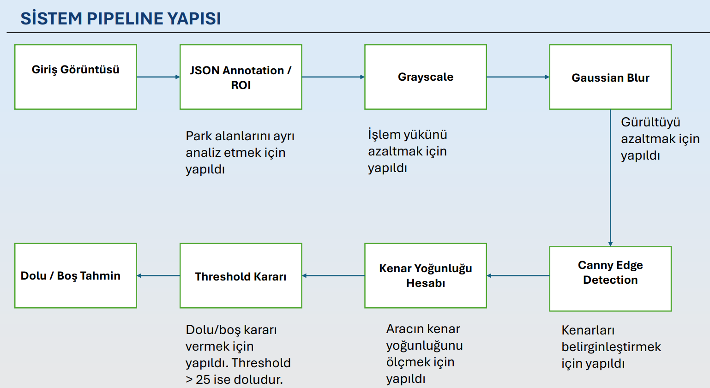
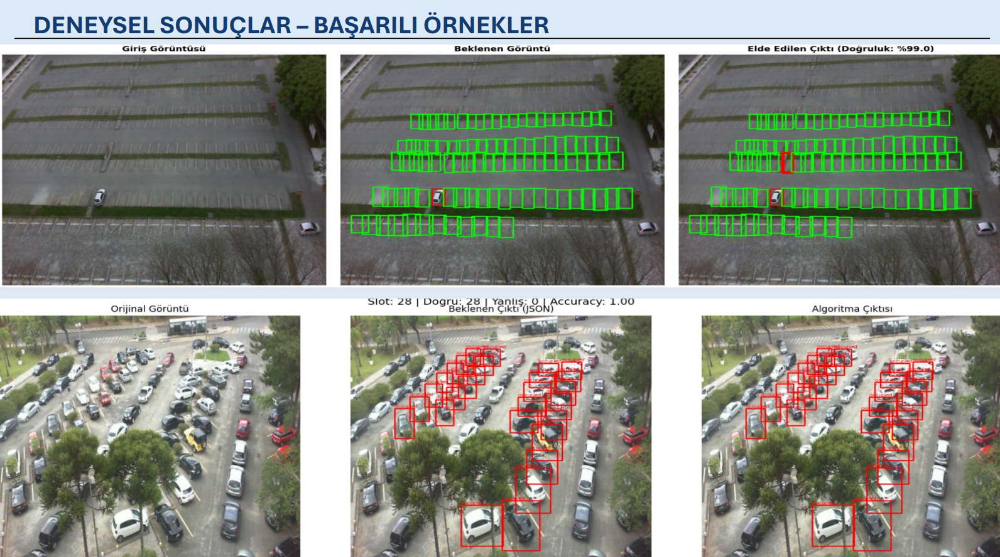
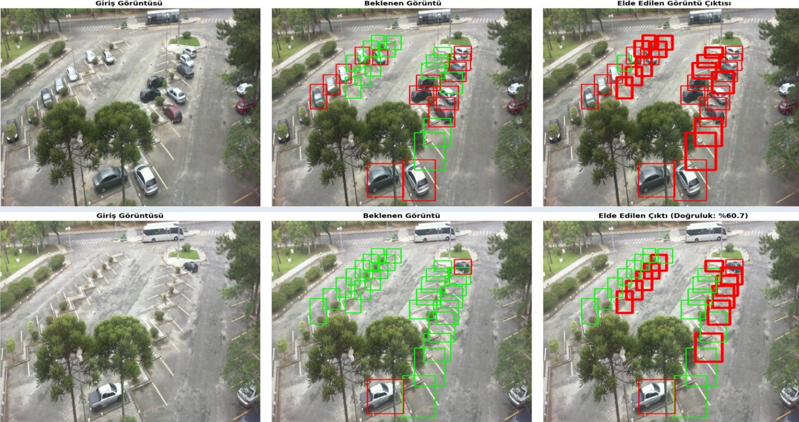
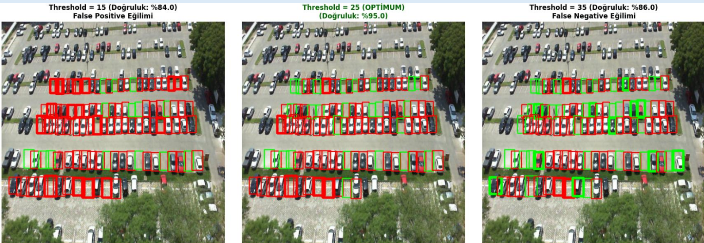

# 🚗 Parking Occupancy Detection using Classical Computer Vision


A computer vision project developed to detect **occupied** and **empty** parking spaces using **classical image processing techniques** with OpenCV.

Unlike deep learning approaches, this project relies entirely on traditional computer vision methods such as grayscale conversion, Gaussian blur, Canny edge detection and edge-density analysis.

---

# 📌 Project Overview

Finding an available parking space is a common problem in large cities. This project analyzes parking lot images and automatically determines whether each parking space is occupied or empty.

The system uses parking space annotations provided in JSON files and processes every parking slot independently.

---

# ✨ Features

- Parking occupancy detection
- Classical Computer Vision approach
- No Machine Learning
- No Deep Learning
- OpenCV implementation
- JSON annotation support
- PKLot Dataset
- Approximately **81.7% validation accuracy**

---

# 🛠 Technologies

- Python
- OpenCV
- NumPy
- Matplotlib
- Google Colab

---

# 📂 Project Structure

```text
Parking-Occupancy-Detection-OpenCV
│
├── docs
│   ├── Project_Report.pdf
│   └── Presentation.pdf
│
├── notebook
│   └── parking_occupancy_detection.ipynb
│
├── images
│   ├── project_overview.png
│   ├── dataset_example.png
│   ├── pipeline.png
│   ├── successful_detection.png
│   ├── failed_detection.png
│   └── threshold_analysis.png
│
├── requirements.txt
├── README.md
├── LICENSE
└── .gitignore
```

---

# ⚙️ Processing Pipeline

The system follows the steps below:

1. Read parking coordinates from JSON annotations.
2. Crop each parking space (ROI).
3. Convert image to Grayscale.
4. Apply Gaussian Blur.
5. Perform Canny Edge Detection.
6. Calculate Edge Density.
7. Compare with a predefined threshold.
8. Classify the parking space as **Occupied** or **Empty**.

---

# 📷 System Pipeline



---

# 🗂 Dataset

The project uses the **PKLot Dataset**.

Due to GitHub file size limitations, the dataset is **not included** in this repository.

Dataset:

https://www.kaggle.com/datasets/ammarnassanalhajali/pklot-dataset

---

# 📈 Results

| Metric | Value |
|---------|-------|
| Validation Accuracy | **81.7%** |
| Programming Language | Python |
| Computer Vision Library | OpenCV |
| Dataset | PKLot |
| Detection Method | Classical Image Processing |

---

# ✅ Successful Detection Example



---

# ❌ Failure Case Example



---

# 📊 Threshold Analysis



---

# 🚀 Installation

Clone the repository

```bash
git clone https://github.com/OmerFarukErdogdu/Parking-Occupancy-Detection-OpenCV.git
```

Install the required packages

```bash
pip install -r requirements.txt
```

Download the PKLot Dataset and update the dataset path inside the notebook.

Run

```text
parking_occupancy_detection.ipynb
```

---

# 💡 Future Improvements

- Real-time video processing
- Deep Learning based detector
- Night-time parking detection
- Web dashboard
- Mobile application support

---

# 👨‍💻 Author

**Ömer Faruk Erdoğdu**

Computer Engineering Student

Istanbul Sabahattin Zaim University

GitHub

https://github.com/OmerFarukErdogdu